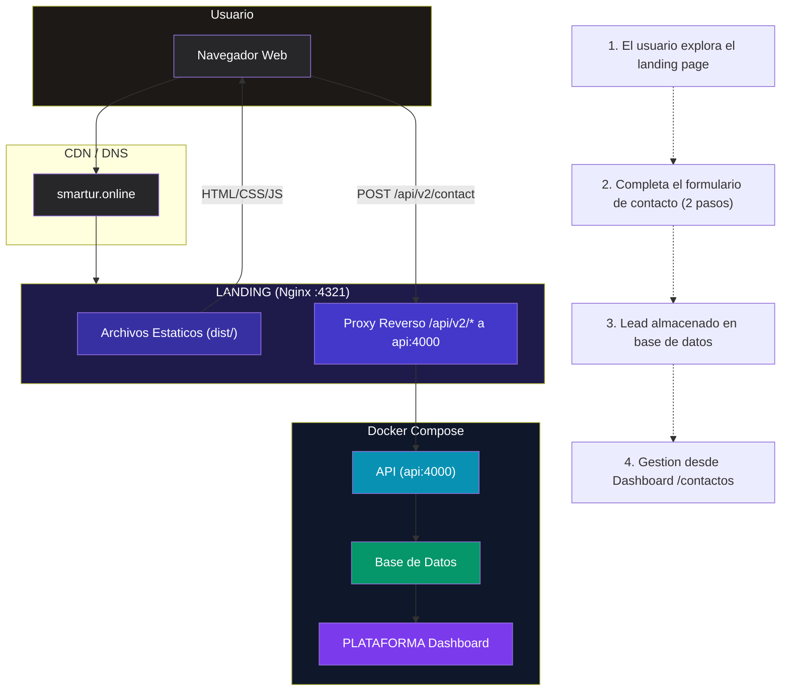
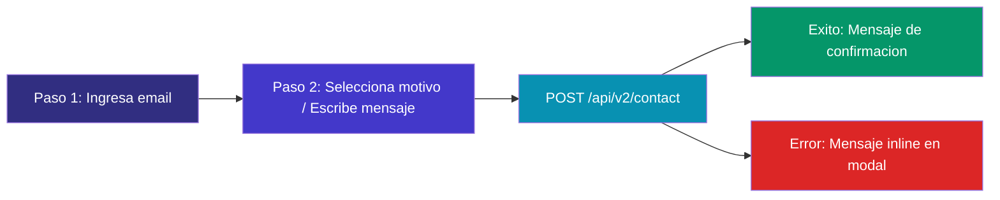
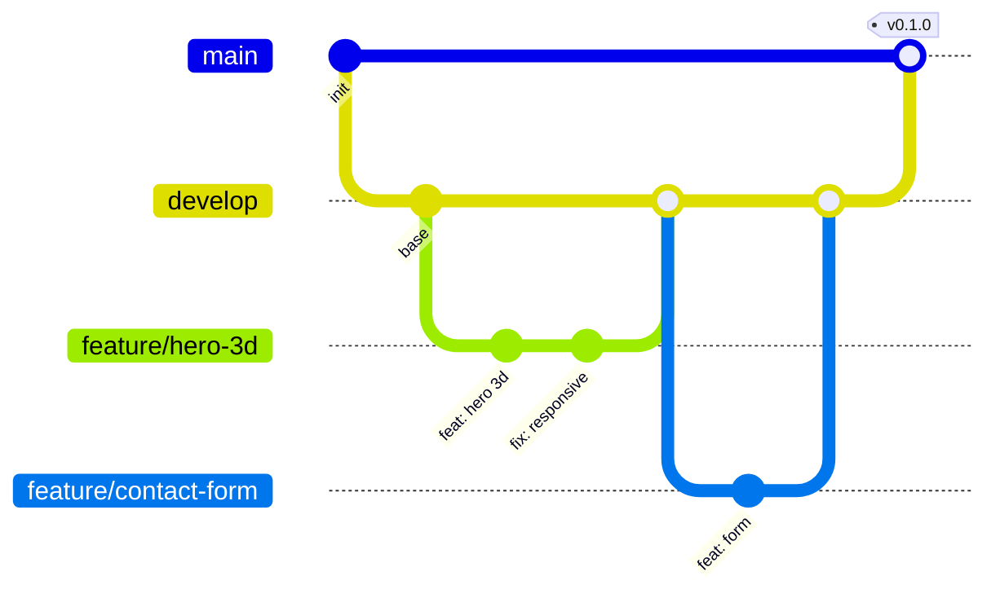

<div align="center">

# SMARTUR · LANDING

**Sitio web institucional de la plataforma de turismo inteligente**

[](https://astro.build)
[](https://react.dev)
[](https://tailwindcss.com)
[](https://threejs.org)
[](https://gsap.com)
[](https://www.typescriptlang.org)
[](https://docker.com)
[](https://astro.build)
[](LICENSE)
[](https://smartur.online)
[](https://utcv.edu.mx)
[]()

<br>


---

## Herramientas de Gestion

Repositorio colaborativo creado para la materia **Administracion de Proyectos de TI** (9 IDGS - UTCV). Contiene el codigo fuente, documentacion y recursos del proyecto **Smartur Landing** — sitio web de presentacion de la plataforma Smartur.

| Informacion | Detalle |
|-------------|---------|
| **Universidad** | Universidad Tecnologica del Centro de Veracruz ([UTCV](https://utcv.edu.mx)) |
| **Materia** | Administracion de Proyectos de TI |
| **Grupo** | 9 IDGS |
| **Periodo** | 2026 |
| **Equipo** | Aaron · Fernanda Pacheco Banda · Martin Lara Olivares |

</div>

---

## Tabla de Contenidos

- [Herramientas de Gestion](#herramientas-de-gestion)
- [Descripcion](#descripcion)
- [Caracteristicas](#caracteristicas)
- [Stack Tecnologico](#stack-tecnologico)
- [Diagrama del Sistema](#diagrama-del-sistema)
- [Manual de Instalacion](#manual-de-instalacion)
  - [Requisitos Previos](#requisitos-previos)
  - [Instalacion Local](#instalacion-local)
  - [Instalacion con Docker](#instalacion-con-docker)
- [Variables de Entorno](#variables-de-entorno)
- [Estructura del Proyecto](#estructura-del-proyecto)
- [Internacionalizacion](#internacionalizacion)
- [Formulario de Contacto](#formulario-de-contacto)
- [Proxy de API](#proxy-de-api)
- [Equipo de Trabajo](#equipo-de-trabajo)
- [Normas de Trabajo Colaborativo](#normas-de-trabajo-colaborativo)

---

## Descripcion

**SMARTUR LANDING** es la pagina de aterrizaje oficial de la plataforma [SMARTUR](https://smartur.online), un ecosistema de turismo inteligente. Construida con **Astro 5** + **React 19**, ofrece una experiencia visual inmersiva con elementos 3D, animaciones fluidas y soporte multilingue (espanol, ingles, frances y portugues).

El sitio funciona como el principal punto de contacto comercial, canalizando leads B2B y consultas de turistas a traves de un formulario de dos pasos que se integra directamente con el dashboard de la **PLATAFORMA SMARTUR**.

---

## Caracteristicas

| # | Caracteristica | Descripcion |
|---|---|---|
| 1 | **Multilingue** | 4 idiomas: ES, EN, FR, PT con enrutamiento i18n nativo de Astro |
| 2 | **3D Interactivo** | Elementos tridimensionales con Three.js + React-Three-Fiber + Spline |
| 3 | **Animaciones Premium** | GSAP ScrollTrigger, Framer Motion, Lenis smooth scroll |
| 4 | **Formulario B2B/B2C** | Modal de 2 pasos con captura de leads, API, Dashboard |
| 5 | **Responsive** | Breakpoints optimizados (tablet, phone, phone-sm) |
| 6 | **TailwindCSS v3** | Estilos utilitarios con modo oscuro nativo |
| 7 | **Dockerizado** | Build multi-etapa con Nginx + proxy inverso |
| 8 | **Rendimiento** | Code splitting por libreria (three, animaciones, lottie, ogl, viz) |
| 9 | **Accesibilidad** | Skip-link, roles ARIA, estructura semantica |

---

## Stack Tecnologico

| Capa | Tecnologia | Version |
|------|-----------|---------|
| Framework | [Astro](https://astro.build) | 5.x |
| UI | [React](https://react.dev) | 19.x |
| Estilos | [TailwindCSS](https://tailwindcss.com) | 3.x |
| 3D | [Three.js](https://threejs.org) + [R3F](https://docs.pmnd.rs/react-three-fiber) + [Spline](https://spline.design) | 0.180 / 9.5 |
| Animaciones | [GSAP](https://gsap.com) + [Framer Motion](https://framer.com/motion) + [Lenis](https://lenis.darkroom.engineering) | 3.13 / 12.34 |
| Lottie | [dotLottie Player](https://github.com/LottieFiles/dotlottie-player) | 2.7 |
| Graficos | [Recharts](https://recharts.org) | 3.7 |
| Lenguaje | [TypeScript](https://www.typescriptlang.org) | 6.x |
| Servidor | [Nginx](https://nginx.org) (produccion) | Alpine |
| Contenedor | [Docker](https://docker.com) | Multi-stage |

---

## Diagrama del Sistema



### Flujo del Formulario de Contacto



---

## Manual de Instalacion

### Requisitos Previos

| Herramienta | Version Minima | Proposito |
|-------------|---------------|-----------|
| [Node.js](https://nodejs.org) | >= 22.x | Entorno de ejecucion |
| [npm](https://npmjs.com) | >= 10.x | Gestor de paquetes (Docker) |
| [pnpm](https://pnpm.io) | >= 9.x | Gestor de paquetes (local) |
| [Docker](https://docker.com) | >= 24.x | Contenedores (opcional) |
| [Git](https://git-scm.com) | >= 2.x | Control de versiones |

### Instalacion Local

```bash
# 1. Clonar el repositorio
git clone <repo-url>
cd LANDING

# 2. Instalar dependencias
pnpm install

# 3. Configurar variables de entorno
cp .env.example .env

# 4. Iniciar servidor de desarrollo
pnpm run dev
```

El servidor se iniciara en **http://localhost:4321**

### Comandos Disponibles

```bash
pnpm run dev       # Servidor de desarrollo (hot-reload)
pnpm run build     # Build de produccion a dist/
pnpm run preview   # Vista previa del build de produccion
pnpm run astro     # CLI de Astro
```

### Instalacion con Docker

```bash
# Build de la imagen
docker compose build landing

# Iniciar el contenedor
docker compose up -d landing

# Ver logs
docker compose logs -f landing
```

> **Nota:** En Docker se usa `npm` en lugar de `pnpm` por restricciones del script en contenedores Alpine.

---

## Variables de Entorno

Crear un archivo `.env` en la raiz del proyecto:

```env
# URL de la plataforma SMARTUR (dashboard)
PUBLIC_TOURIST_APP_URL=https://app.smartur.mx/

# URL publica del sitio (para metadatos SEO)
PUBLIC_SITE_URL=https://smartur.online
```

| Variable | Tipo | Requerida | Descripcion |
|----------|------|-----------|-------------|
| `PUBLIC_TOURIST_APP_URL` | `string` | Si | URL del dashboard de PLATAFORMA |
| `PUBLIC_SITE_URL` | `string` | No | URL canonica del sitio |

---

## Estructura del Proyecto

```
LANDING/
+-- src/
|   +-- pages/
|   |   +-- index.astro           # ES - Espanol (default)
|   |   +-- en/index.astro        # EN - Ingles
|   |   +-- fr/index.astro        # FR - Frances
|   |   +-- pt/index.astro        # PT - Portugues
|   |   +-- 404.astro             # Pagina no encontrada
|   +-- components/               # Componentes Astro + React
|   |   +-- ContactForm.astro     #   Formulario de contacto (2 pasos)
|   |   +-- HeroHome.astro        #   Hero principal
|   |   +-- Header.astro          #   Barra de navegacion
|   |   +-- Footer.astro          #   Pie de pagina
|   |   +-- Plans.astro           #   Seccion de planes
|   |   +-- Testimonials.astro    #   Testimonios
|   |   +-- Faqs.astro            #   Preguntas frecuentes
|   |   +-- ... (30+ componentes)
|   +-- layouts/
|   |   +-- Layout.astro          # Layout base HTML + SEO + Navegacion
|   +-- styles/                   # Estilos globales
|   |   +-- global.css
|   |   +-- tokens.css            #   Variables de diseno
|   |   +-- reset.css             #   Reset CSS
|   |   +-- ...
|   +-- assets/                   # Recursos estaticos
|   |   +-- imgs/                 #   Imagenes
|   |   +-- video/                #   Videos
|   |   +-- 3d/                   #   Modelos 3D (.glb)
|   |   +-- icons/                #   Iconos SVG
|   |   +-- *.lottie              #   Animaciones Lottie
|   +-- i18n/                     # Traducciones
|   |   +-- ui.ts                 #   Strings de traduccion
|   |   +-- utils.ts              #   Hook useTranslations
|   +-- utils/                    # Utilidades JS
+-- docs/                         # Documentacion tecnica
+-- resources/                    # Recursos visuales y diagramas
+-- astro.config.mjs              # Configuracion de Astro
+-- tailwind.config.mjs           # Configuracion de Tailwind v3
+-- nginx.conf                    # Configuracion de Nginx
+-- Dockerfile                    # Build multi-etapa
+-- docker-compose.yml            # Orquestacion de contenedores
+-- package.json                  # Dependencias y scripts
```

---

## Internacionalizacion

El sitio utiliza el sistema de enrutamiento i18n nativo de Astro.

| Ruta | Idioma | Prefijo |
|------|--------|---------|
| `/` | Espanol | Default (sin prefijo) |
| `/en/` | Ingles | `en` |
| `/fr/` | Frances | `fr` |
| `/pt/` | Portugues | `pt` |

Los textos se gestionan mediante el modulo `src/i18n/ui.ts` y se consumen con el hook `useTranslations()` desde `src/i18n/utils.ts`.

---

## Formulario de Contacto

El formulario sigue un flujo de **2 pasos** disenado para maximizar la conversion:

### Paso 1 — Captura de Email
- Campo de email visible directamente en la pagina
- Validacion en cliente con regex
- Al enviar, se muestra el modal del paso 2

### Paso 2 — Modal Completo
- Email pre-cargado desde el paso 1
- Selector de motivo (7 opciones)
- Area de mensaje (min. 10 caracteres)
- Botones Cancelar / Enviar

### Motivos Disponibles

| Valor | Etiqueta | Tipo |
|-------|----------|------|
| `download` | Descargar guia | B2B |
| `join` | Unirse a la plataforma | B2B |
| `pricing` | Solicitar precios | B2B |
| `evaluation` | Evaluacion | B2B |
| `tourist` | Informacion turistica | B2C |
| `suggestion` | Sugerencia | B2C |
| `other` | Otro | — |

### Integracion
- **Endpoint:** `POST /api/v2/contact`
- **Cuerpo:** `{ email, reason, message, source: "landing_b2b" | "landing_turista" }`
- **Destino:** Base de datos (visible en PLATAFORMA Dashboard > Contactos)
- **Nota:** No se envia notificacion por email

---

## Proxy de API

El servidor Nginx en produccion redirige las peticiones `/api/` hacia el contenedor de la API:

```nginx
location /api/ {
    proxy_pass http://api:4000/api/;
    proxy_http_version 1.1;
    proxy_set_header Upgrade $http_upgrade;
    proxy_set_header Connection 'upgrade';
    proxy_set_header Host $host;
    proxy_cache_bypass $http_upgrade;
}
```

Esto permite que el formulario de contacto funcione sin problemas de CORS, manteniendo todo bajo el mismo dominio.

---

## Equipo de Trabajo

### Integrantes

| Miembro | Rol Principal |
|---------|--------------|
| **Aaron** | Frontend Lead — Arquitectura de componentes, Three.js/3D, rendimiento |
| **Fernanda Pacheco Banda** | UI/UX Designer + Content Manager — Sistema de diseno, traducciones, contenido multimedia |
| **Martin Lara Olivares** | DevOps + Backend Liaison — Docker, Nginx, CI/CD, integracion con API |

### Roles Funcionales del Proyecto

| Rol | Responsabilidades |
|-----|-------------------|
| Frontend Lead | Arquitectura de componentes, rendimiento, code reviews, integracion con API |
| UI/UX Designer | Sistema de diseno, prototipos, experiencia de usuario, accesibilidad |
| DevOps | Docker, Nginx, CI/CD, despliegue en produccion, monitorizacion |
| Content Manager | Traducciones (ES/EN/FR/PT), redaccion SEO, gestion de contenido multimedia |
| QA Engineer | Pruebas cross-browser, responsive, regresion visual, validacion de formularios |
| Backend Liaison | Coordinacion con el equipo de PLATAFORMA para integracion de API y dashboard |

---

## Normas de Trabajo Colaborativo

### Git Flow



### Convenciones

| Aspecto | Regla |
|---------|-------|
| Ramas | `main` > produccion, `develop` > integracion, `feature/*` > features |
| Commits | [Conventional Commits](https://www.conventionalcommits.org): `feat:`, `fix:`, `style:`, `refactor:`, `docs:` |
| PRs | Toda feature debe pasar por Pull Request con al menos 1 approval |
| Code Review | Revisar funcionamiento, accesibilidad, rendimiento y responsividad |
| Estilo | TypeScript estricto, seguir patrones existentes, no anadir comentarios triviales |

### Buenas Practicas

- [OK] Ejecutar `pnpm run build` antes de hacer commit para verificar errores
- [OK] Mantener las ramas `main` y `develop` siempre en estado verde (build pasando)
- [OK] Documentar las variables de entorno en `.env.example`
- [OK] Actualizar el README cuando se anadan funcionalidades significativas
- [OK] Seguir las guias de estilo del proyecto (Tailwind v3, no v4 como PLATAFORMA)
- [NO] No commitear secrets, claves API o archivos `.env`
- [NO] No mezclar cambios de feature con refactors o cambios de estilo

---

<div align="center">

---

**SMARTUR** — *Turismo Inteligente*  
[smartur.online](https://smartur.online) · [Dashboard](https://app.smartur.mx/)

</div>
