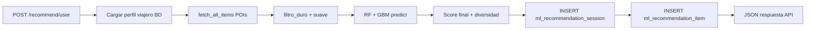

# SMARTUR v4 — Modelo de predicción (documentación para entrega)

## Resumen ejecutivo

SMARTUR integra **tres algoritmos de machine learning** para recomendar puntos de interés turísticos:

| # | Algoritmo | Librería | Rol |
|---|-----------|----------|-----|
| 1 | **Filtrado colaborativo Pearson + KNN** | `NearestNeighbors` + correlación centrada | Predice rating por similitud entre usuarios |
| 2 | **Random Forest contextual** | `RandomForestRegressor` | Predice rating con features Item×Usuario×Match |
| 3 | **Gradient Boosting contextual** | `GradientBoostingRegressor` | Segundo modelo contextual; comparado y fusionado con RF |

Los tres se **evalúan con RMSE y MAE** sobre el test set de Yelp; el de menor RMSE (o el híbrido) se registra en `models/algorithm_metrics.json` y en PostgreSQL (`ml_model_metrics`). La API FastAPI expone predicción, métricas y consulta de resultados persistidos.

---

## 1. Interfaz de acceso (API)

**Base URL:** `http://localhost:8000` (servicio Docker `smartur-modelo`, puerto 8000)

**Documentación interactiva:** [http://localhost:8000/docs](http://localhost:8000/docs)

### Endpoints principales

| Método | Ruta | Descripción |
|--------|------|-------------|
| `GET` | `/health` | Estado de CF, RF, GBM y algoritmo seleccionado |
| `GET` | `/health/poi-db` | Conectividad a PostgreSQL (POIs + persistencia) |
| `GET` | `/metrics/models` | Métricas RMSE/MAE de la comparativa de los 3 algoritmos |
| `POST` | `/metrics/evaluate` | Re-ejecuta comparativa y persiste resultados |
| `POST` | `/recommend/{user_id}` | **Genera** recomendaciones (contexto + perfil viajero) y **guarda** en BD |
| `GET` | `/recommend/{user_id}` | Genera recomendaciones (sin contexto POST) y persiste |
| `GET` | `/recommendations/{user_id}` | **Solo lectura** — últimas recomendaciones guardadas en BD |
| `POST` | `/train-rf` | Re-entrena Random Forest |
| `POST` | `/train-gbm` | Re-entrena Gradient Boosting |

### Ejemplo de petición (integración con la app)

```http
POST /recommend/42
Content-Type: application/json

{
  "alpha": 0.2,
  "top_n": 5,
  "context": {
    "presupuesto_bucket": "medio",
    "edad_range": "25-34",
    "tiposTurismo": ["naturaleza", "cultural"],
    "group_type": "pareja",
    "needs_hotel": false,
    "pref_food": true,
    "requiere_accesibilidad": false,
    "pref_outdoor": true
  }
}
```

### Respuesta

```json
{
  "user_id": "42",
  "recommendations": [
    {
      "item_id": "12",
      "title": "Cascada El Salto",
      "score": 4.21,
      "pred_cf": 4.05,
      "pred_rf": 4.18,
      "pred_gbm": 4.12,
      "kind": "poi",
      "image_url": "https://..."
    }
  ],
  "alpha": 0.2,
  "best_algorithm": "hybrid_triple",
  "execution_time_ms": 87.4,
  "session_id": 15
}
```

La **aplicación principal** (PLATAFORMA/API Node) debe consumir `POST /recommend/{user_id}` para generar y `GET /recommendations/{user_id}` para mostrar historial sin recalcular.

---

## 2. Modelo de predicción

### 2.1 Algoritmo 1 — CF Pearson + KNN

- **Archivos:** `engine.py`, `cf.py`
- Matriz usuario-ítem dispersa centrada por media de usuario.
- `NearestNeighbors(metric='cosine')` ≈ correlación de Pearson sobre ratings centrados.
- Predicción: media del usuario + promedio ponderado de desviaciones de vecinos que calificaron el ítem.

### 2.2 Algoritmo 2 — Random Forest contextual

- **Archivo:** `rf_model.py`
- ~35 features: negocio + contexto de viajero + match (presupuesto, turismo, familia/pareja).
- Entrenamiento con contexto sintético inferido del historial Yelp.
- Persistencia: `models/rf_context_yelp.joblib`

### 2.3 Algoritmo 3 — Gradient Boosting contextual

- **Archivo:** `gbm_model.py`
- Mismas features que RF; algoritmo distinto (`GradientBoostingRegressor`).
- Persistencia: `models/gbm_context_yelp.joblib`

### 2.4 Selección del mejor modelo

- **Archivo:** `model_metrics.py`
- Compara RMSE/MAE de baseline, CF, RF, GBM, híbrido CF+RF y híbrido triple.
- Guarda `best_algorithm`, `best_alpha` y pesos `local_blend` para POIs locales.

### 2.5 Fusión en producción

- **Archivo:** `fusion.py`
- Pool: POIs + servicios turísticos desde PostgreSQL.
- Filtros duros (accesibilidad, hotel, comida, outdoor) y suaves (`tiposTurismo`).
- Ranking: ensemble RF+GBM + boost content-based para POIs sin historial Yelp.

---

## 3. Generación de resultados



1. Se fusiona contexto del formulario React con `traveler_profile` en Postgres.
2. Se puntúan candidatos con RF, GBM y señal content-based.
3. Se ordenan, diversifican por categoría y se devuelve top-N.
4. Se persisten en `ml_recommendation_session` / `ml_recommendation_item`.
5. Consultas posteriores usan `GET /recommendations/{user_id}` (solo BD).

Migración SQL: `migrations/001_ml_recommendations.sql`

---

## 4. Métricas de análisis obtenidas

### Predicción (regresión de ratings 1–5)

| Métrica | Uso |
|---------|-----|
| **RMSE** | Error cuadrático medio — criterio principal para elegir algoritmo |
| **MAE** | Error absoluto medio — interpretabilidad |
| Curvas de error | Distribución \|error\| ≤ 0.5, 1.0, 1.5, 2.0 (híbrido) |

### Ranking (recomendación top-K)

| Métrica | Uso |
|---------|-----|
| **NDCG@K** | Calidad del orden respecto a relevancia |
| **Precision@K** | Proporción de aciertos en top-K |
| **Hit Rate@K** | Si aparece al menos un ítem relevante |

### Cómo reproducir

```bash
cd src
python evaluate.py          # RMSE/MAE + ranking + guarda algorithm_metrics.json
python optimize_alpha.py    # Grid search de alpha CF/RF
```

API: `POST /metrics/evaluate?sample_size=500`  
Consulta: `GET /metrics/models`

---

## 5. Tiempo de ejecución

- Cada respuesta de `/recommend` incluye **`execution_time_ms`** (medido con `time.perf_counter()`).
- El valor se guarda en `ml_recommendation_session.execution_time_ms`.
- Típico en producción (pool local < 100 POIs): **50–200 ms** por petición (depende de CPU y BD).
- Arranque inicial (sin modelos en disco): varios minutos (entrenamiento RF+GBM sobre ~80k interacciones).

---

## Cumplimiento de requisitos académicos

| Requisito | Cumplimiento |
|-----------|--------------|
| ≥ 3 algoritmos ML | CF+KNN/Pearson, Random Forest, Gradient Boosting |
| Construir y evaluar; elegir el mejor | `model_metrics.py`, `evaluate.py`, `POST /metrics/evaluate` |
| API integrada | FastAPI puerto 8000, consumible por PLATAFORMA |
| Resultados en persistencia | Tablas `ml_recommendation_*` en PostgreSQL |
| Solo consultables desde la app | `GET /recommendations/{user_id}` lee solo BD (no recalcula) |
| Tiempo de ejecución | Campo `execution_time_ms` en respuesta y BD |

---

## Variables de entorno

| Variable | Descripción |
|----------|-------------|
| `POI_DB_HOST`, `POI_DB_PORT`, `POI_DB_NAME`, `POI_DB_USER`, `POI_DB_PASSWORD` | PostgreSQL |
| `SKIP_MODEL_BOOT=1` | Arranque sin modelos (tests) |
| `CORS_ORIGINS` | Orígenes permitidos (PLATAFORMA, etc.) |
